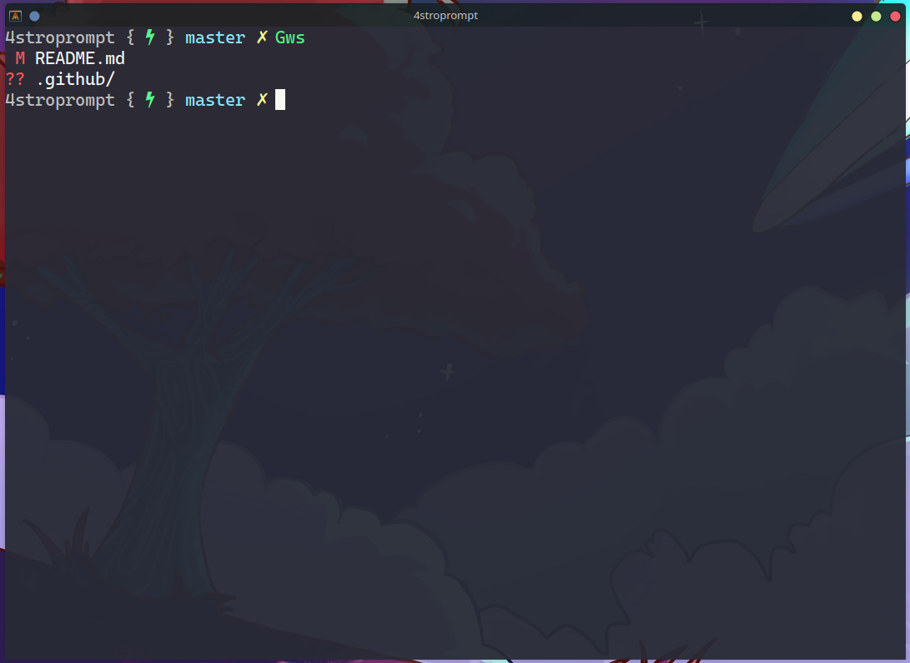

# 4stroprompt
A prompt plugin form [zimfw](https://github.com/zimfw/zimfw).
It is mainly inspired by gitster theme and [CodelyTV](https://github.com/CodelyTV)
prompt.

## Installation
Put this into your .zimrc file

    zmodule 4strodev/4stroprompt

## Features

### Minimalist

### Shows git info

### Process execution status

## Deps
It requires to have installed:

- A [nerd font](https://www.nerdfonts.com/) to show icons
- [git-info](https://github.com/zimfw/git-info)
- [prompt-pwd](https://github.com/zimfw/prompt-pwd)
